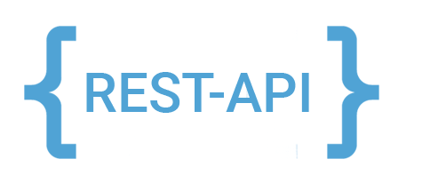

<h1 align="center">Hi 👋, I am Mateus Rosario</h1>

[english version](README.md)

    Sou estudante de Ciência da Computação, com habilidades e experiências em desenvolvimento Fullstack. Tenho conhecimentos nas áreas de IA, processamento de imagens, gerência de projetos e engenharia de softwares. Muito apaixonado pela tecnologia e desenvolvimento.

 

- 🔭 Estou trabalhando em **projetos web Fullstack**

- 🌱 Estou atualmente aprendendo **desenvolvimento web com React**

- 💞️ Intessado em colaborar e aprender mais habilidades

- 👨‍💻 Meus projetos estão disponíveis no meu perfil no [**github**](https://github.com/MateusRosario)

- 📫 Você pode me contatar em **mateusrosario.me@gmail.com**

- :electric_plug: Conecte-se comigo pelo meu [**linkedin**](https://www.linkedin.com/in/mateus-da-silva-rosario-275420176/)

- :stuck_out_tongue: Uma curiosidade sobre mim é que sou muito entusiasmado com o futuro da RA e RV.

 

### Linguagens e Ferramentas:

<!-- languages -->

    
    
    
    
    
    
    
    

 

<!-- tools -->

    
    
    
    
    
    
    
    
    

 
 
 
